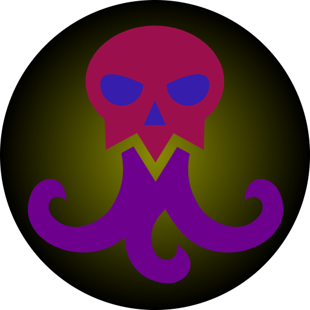

 

_"[Tentacle scull icon](https://game-icons.net/1x1/lorc/tentacles-skull.html)"
by [Lorc](https://lorcblog.blogspot.com/)
is licensed under [CC BY 3.0](https://creativecommons.org/licenses/by/3.0/) 
/ colorized_

# Weirdo

A weird AI to control creeps

## Status 
At the moment... Hello World!

## Structure

### Roles

Roles are responsible for choosing an appropriate task to work towards
a specific goal. For example the starter role will harvest energy and bring
it to the spawn at the beginning of the game, in order to "start up" 
the game.

### Tasks
Tasks handle the logic for a creep to do basic things, like 
getting some energy or upgrade the controller.
In order to do so each task will create an action when it is 
called. A task will also handle the selection of appropriate
targets and the caching of the current target.

### Actions
An action is command which a creep can execute in one tick.
For example `creep.moveTo()` or `creep.harvest()`.

## License

This project is licensed under the EUPL 1.2 or later. You can find 
a copy of the license in the [license](./LICENSE) folder or under 
[this](https://joinup.ec.europa.eu/collection/eupl/eupl-text-eupl-12) 
address.

This project uses external libraries and assets that are under their own
licenses.

It is not a goal of this project to infringe someone's copyright.
Please feel free to reach out, if you feel that this project
infringes your copyright.
## Codestyle

